# Nimo Platform - System Architecture Diagrams
**Visual Reference Guide - August 31, 2025**

## 1. High-Level System Architecture

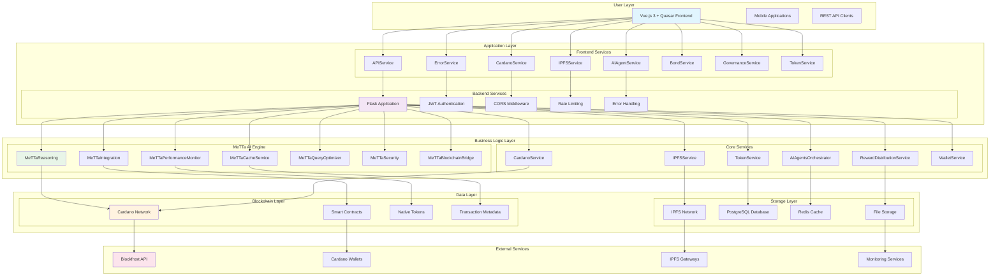

## 2. API Endpoint Architecture

```mermaid
graph LR
    subgraph "API Gateway"
        GW[Flask Application<br/>app.py]
    end

    subgraph "Authentication & Security"
        A1[POST /api/auth/register]
        A2[POST /api/auth/login]
        A3[POST /api/auth/refresh]
        A4[GET /api/auth/me]
        A5[POST /api/auth/logout]
        A6[POST /api/auth/verify]
    end

    subgraph "User Management"
        U1[GET /api/user/profile]
        U2[PUT /api/user/profile]
        U3[GET /api/user/stats]
        U4[GET /api/user/contributions]
        U5[GET /api/user/rewards]
        U6[POST /api/user/avatar]
        U7[GET /api/user/dashboard]
        U8[PUT /api/user/preferences]
    end

    subgraph "Contribution System"
        C1[GET /api/contributions]
        C2[POST /api/contributions]
        C3[GET /api/contributions/{id}]
        C4[PUT /api/contributions/{id}]
        C5[DELETE /api/contributions/{id}]
        C6[POST /api/contributions/{id}/verify]
        C7[GET /api/contributions/{id}/evidence]
        C8[POST /api/contributions/{id}/evidence]
        C9[GET /api/contributions/pending]
        C10[POST /api/contributions/{id}/approve]
        C11[POST /api/contributions/{id}/reject]
        C12[GET /api/contributions/stats]
    end

    subgraph "Autonomous System"
        AS1[GET /api/autonomous/health]
        AS2[POST /api/autonomous/cycle]
        AS3[POST /api/autonomous/contributions/{id}/process]
        AS4[POST /api/autonomous/contributions/{id}/reward]
        AS5[POST /api/autonomous/platform/optimize]
        AS6[POST /api/autonomous/governance/execute]
        AS7[POST /api/autonomous/security/manage]
        AS8[POST /api/autonomous/contributions/{id}/fraud-detect]
        AS9[POST /api/autonomous/analytics/predict]
        AS10[POST /api/autonomous/batch/process]
        AS11[GET /api/autonomous/status]
        AS12[POST /api/autonomous/rules/reload]
        AS13[GET /api/autonomous/metrics]
        AS14[POST /api/autonomous/learning/train]
        AS15[GET /api/autonomous/learning/status]
        AS16[POST /api/autonomous/adaptation/adapt]
        AS17[GET /api/autonomous/adaptation/status]
    end

    subgraph "Cardano Integration"
        CA1[GET /api/cardano/status]
        CA2[GET /api/cardano/balance/{address}]
        CA3[POST /api/cardano/calculate-reward]
        CA4[POST /api/cardano/contribution-reward-preview]
        CA5[GET /api/cardano/faucet-info]
        CA6[POST /api/cardano/transaction]
        CA7[GET /api/cardano/transaction/{hash}]
        CA8[GET /api/cardano/address/{address}/transactions]
        CA9[POST /api/cardano/wallet/create]
        CA10[POST /api/cardano/wallet/restore]
        CA11[GET /api/cardano/pools]
        CA12[POST /api/cardano/delegate]
        CA13[GET /api/cardano/assets]
        CA14[POST /api/cardano/mint]
        CA15[GET /api/cardano/metadata/{hash}]
    end

    subgraph "Token Management"
        T1[GET /api/tokens/balance]
        T2[POST /api/tokens/transfer]
        T3[GET /api/tokens/transactions]
        T4[POST /api/tokens/stake]
        T5[GET /api/tokens/rewards]
        T6[POST /api/tokens/claim]
    end

    subgraph "Impact Bonds"
        B1[GET /api/bonds]
        B2[POST /api/bonds]
        B3[GET /api/bonds/{id}]
        B4[PUT /api/bonds/{id}]
        B5[POST /api/bonds/{id}/invest]
        B6[GET /api/bonds/{id}/investors]
        B7[POST /api/bonds/{id}/milestone]
        B8[GET /api/bonds/{id}/returns]
    end

    subgraph "Governance"
        G1[GET /api/governance/proposals]
        G2[POST /api/governance/proposals]
        G3[GET /api/governance/proposals/{id}]
        G4[POST /api/governance/proposals/{id}/vote]
        G5[GET /api/governance/proposals/{id}/votes]
        G6[POST /api/governance/execute]
    end

    subgraph "Health & Monitoring"
        H1[GET /api/health]
        H2[GET /api/health/detailed]
        H3[GET /api/health/services/{name}]
        H4[GET /api/health/metrics]
        H5[GET /api/health/performance]
        H6[GET /api/health/autonomous]
        H7[GET /api/health/ready]
        H8[GET /api/health/live]
    end

    subgraph "Identity Management"
        I1[POST /api/identity/verify-did]
        I2[POST /api/identity/verify-ens]
        I3[GET /api/identity/supported-methods]
        I4[POST /api/identity/create]
        I5[GET /api/identity/{did}]
        I6[PUT /api/identity/{did}]
        I7[DELETE /api/identity/{did}]
    end

    subgraph "AI Agents"
        AI1[GET /api/ai-agents]
        AI2[POST /api/ai-agents]
        AI3[GET /api/ai-agents/{id}]
        AI4[PUT /api/ai-agents/{id}]
        AI5[DELETE /api/ai-agents/{id}]
        AI6[POST /api/ai-agents/{id}/execute]
        AI7[GET /api/ai-agents/{id}/history]
        AI8[POST /api/ai-agents/{id}/train]
        AI9[GET /api/ai-agents/{id}/performance]
        AI10[POST /api/ai-agents/batch]
        AI11[GET /api/ai-agents/metrics]
        AI12[POST /api/ai-agents/optimize]
        AI13[GET /api/ai-agents/status]
    end

    GW --> A1
    GW --> A2
    GW --> A3
    GW --> A4
    GW --> A5
    GW --> A6

    GW --> U1
    GW --> U2
    GW --> U3
    GW --> U4
    GW --> U5
    GW --> U6
    GW --> U7
    GW --> U8

    GW --> C1
    GW --> C2
    GW --> C3
    GW --> C4
    GW --> C5
    GW --> C6
    GW --> C7
    GW --> C8
    GW --> C9
    GW --> C10
    GW --> C11
    GW --> C12

    GW --> AS1
    GW --> AS2
    GW --> AS3
    GW --> AS4
    GW --> AS5
    GW --> AS6
    GW --> AS7
    GW --> AS8
    GW --> AS9
    GW --> AS10
    GW --> AS11
    GW --> AS12
    GW --> AS13
    GW --> AS14
    GW --> AS15
    GW --> AS16
    GW --> AS17

    GW --> CA1
    GW --> CA2
    GW --> CA3
    GW --> CA4
    GW --> CA5
    GW --> CA6
    GW --> CA7
    GW --> CA8
    GW --> CA9
    GW --> CA10
    GW --> CA11
    GW --> CA12
    GW --> CA13
    GW --> CA14
    GW --> CA15

    GW --> T1
    GW --> T2
    GW --> T3
    GW --> T4
    GW --> T5
    GW --> T6

    GW --> B1
    GW --> B2
    GW --> B3
    GW --> B4
    GW --> B5
    GW --> B6
    GW --> B7
    GW --> B8

    GW --> G1
    GW --> G2
    GW --> G3
    GW --> G4
    GW --> G5
    GW --> G6

    GW --> H1
    GW --> H2
    GW --> H3
    GW --> H4
    GW --> H5
    GW --> H6
    GW --> H7
    GW --> H8

    GW --> I1
    GW --> I2
    GW --> I3
    GW --> I4
    GW --> I5
    GW --> I6
    GW --> I7

    GW --> AI1
    GW --> AI2
    GW --> AI3
    GW --> AI4
    GW --> AI5
    GW --> AI6
    GW --> AI7
    GW --> AI8
    GW --> AI9
    GW --> AI10
    GW --> AI11
    GW --> AI12
    GW --> AI13

    style GW fill:#e3f2fd
    style A1 fill:#f3e5f5
    style U1 fill:#e8f5e8
    style C1 fill:#fff3e0
    style AS1 fill:#fce4ec
    style CA1 fill:#f1f8e9
    style T1 fill:#e0f2f1
    style B1 fill:#f9fbe7
    style G1 fill:#efebe9
    style H1 fill:#fce4ec
    style I1 fill:#f3e5f5
    style AI1 fill:#e8f5e8
```

## 3. Service Layer Architecture

```mermaid
graph TB
    subgraph "Flask Application"
        APP[app.py<br/>Main Application]
    end

    subgraph "Route Layer (13 modules)"
        R1[auth.py<br/>6 endpoints]
        R2[user.py<br/>8 endpoints]
        R3[contribution.py<br/>12 endpoints]
        R4[token.py<br/>6 endpoints]
        R5[bond.py<br/>8 endpoints]
        R6[identity.py<br/>7 endpoints]
        R7[cardano.py<br/>15 endpoints]
        R8[blockchain.py<br/>API gateway]
        R9[autonomous.py<br/>17 endpoints]
        R10[health.py<br/>8 endpoints]
        R11[ai_agents.py<br/>13 endpoints]
        R12[governance.py<br/>6 endpoints]
        R13[usdc.py<br/>Legacy endpoints]
    end

    subgraph "MeTTa AI Services (9 services)"
        M1[MeTTaReasoning<br/>AI reasoning engine]
        M2[MeTTaIntegrationService<br/>Core integration]
        M3[MeTTaPerformanceMonitor<br/>Performance tracking]
        M4[MeTTaCacheService<br/>Intelligent caching]
        M5[MeTTaQueryOptimizer<br/>Query optimization]
        M6[MeTTaSecurity<br/>AI security]
        M7[MeTTaRunner<br/>MeTTa execution]
        M8[MeTTaBlockchainBridge<br/>AI-blockchain bridge]
        M9[MeTTaMockService<br/>Testing service]
    end

    subgraph "Blockchain Services (5 services)"
        B1[BlockchainService<br/>Core blockchain ops]
        B2[BlockchainUserService<br/>User blockchain ops]
        B3[BlockchainContributionService<br/>Contribution ops]
        B4[BlockchainTokenService<br/>Token operations]
        B5[BlockchainCacheService<br/>Blockchain caching]
    end

    subgraph "Core Services (12 services)"
        C1[CardanoService<br/>Cardano integration]
        C2[IPFSService<br/>Decentralized storage]
        C3[TokenService<br/>Token management]
        C4[AIAgentsOrchestrator<br/>AI orchestration]
        C5[RewardDistributionService<br/>Reward distribution]
        C6[ErrorHandler<br/>Error handling]
        C7[RateLimiter<br/>Rate limiting]
        C8[WalletService<br/>Wallet operations]
        C9[SignatureVerification<br/>Digital signatures]
        C10[DIDVerification<br/>DID verification]
        C11[BaseBlockchainService<br/>Base blockchain ops]
        C12[SecureTokenService<br/>Secure token ops]
    end

    subgraph "Infrastructure"
        I1[SQLAlchemy<br/>Database ORM]
        I2[Redis<br/>Caching layer]
        I3[JWT<br/>Authentication]
        I4[CORS<br/>Cross-origin]
        I5[Logging<br/>System logging]
        I6[Monitoring<br/>Health monitoring]
    end

    APP --> R1
    APP --> R2
    APP --> R3
    APP --> R4
    APP --> R5
    APP --> R6
    APP --> R7
    APP --> R8
    APP --> R9
    APP --> R10
    APP --> R11
    APP --> R12
    APP --> R13

    R1 --> M1
    R2 --> M2
    R3 --> M3
    R4 --> M4
    R5 --> M5
    R6 --> M6
    R7 --> M7
    R8 --> M8
    R9 --> M9

    R1 --> B1
    R2 --> B2
    R3 --> B3
    R4 --> B4
    R5 --> B5

    R1 --> C1
    R2 --> C2
    R3 --> C3
    R4 --> C4
    R5 --> C5
    R6 --> C6
    R7 --> C7
    R8 --> C8
    R9 --> C9
    R10 --> C10
    R11 --> C11
    R12 --> C12

    C1 --> I1
    C2 --> I2
    C3 --> I3
    C4 --> I4
    C5 --> I5
    C6 --> I6

    style APP fill:#e3f2fd
    style R1 fill:#f3e5f5
    style M1 fill:#e8f5e8
    style B1 fill:#fff3e0
    style C1 fill:#fce4ec
    style I1 fill:#f1f8e9
```

## 4. Data Flow Architecture

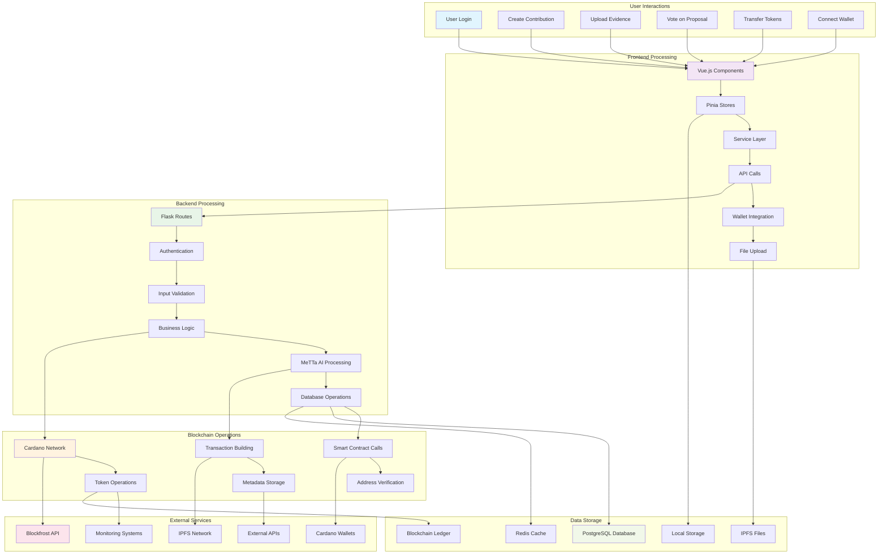

## 5. Security Architecture

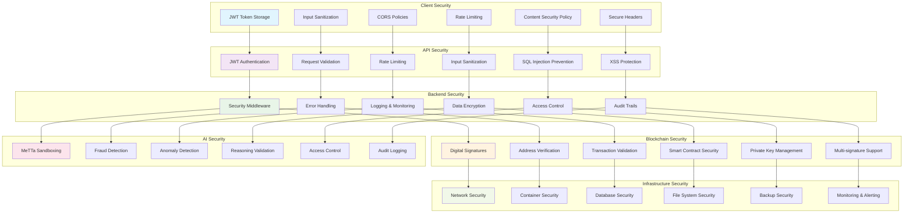

## 6. Deployment Architecture

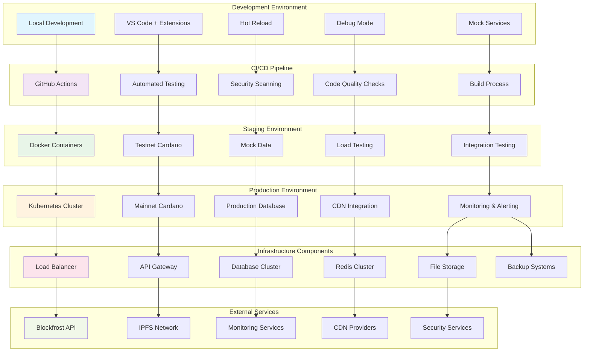

## 7. Implementation Status Dashboard

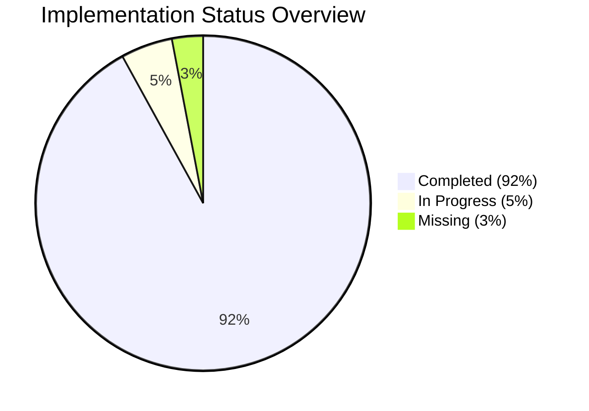

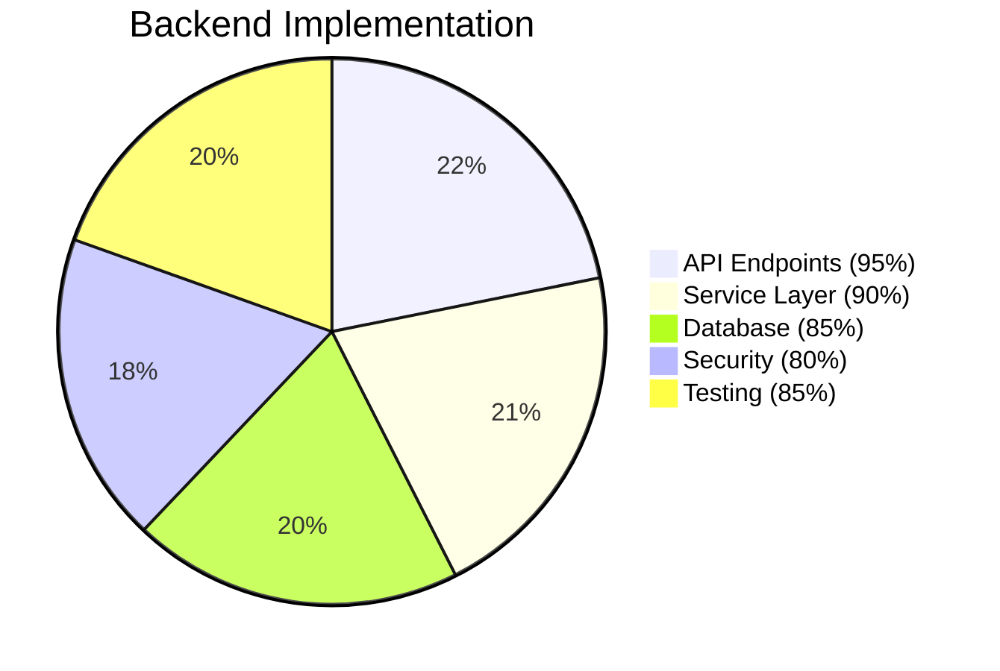

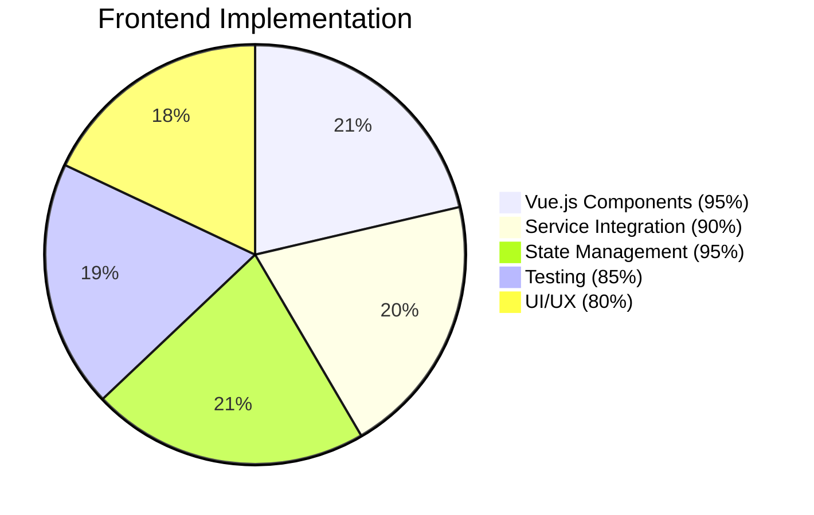

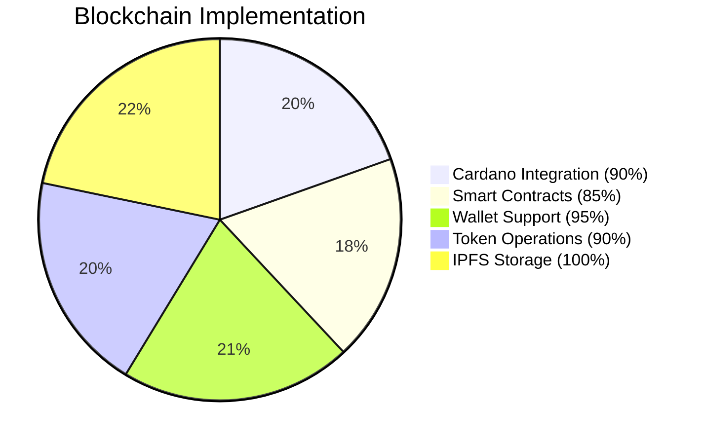

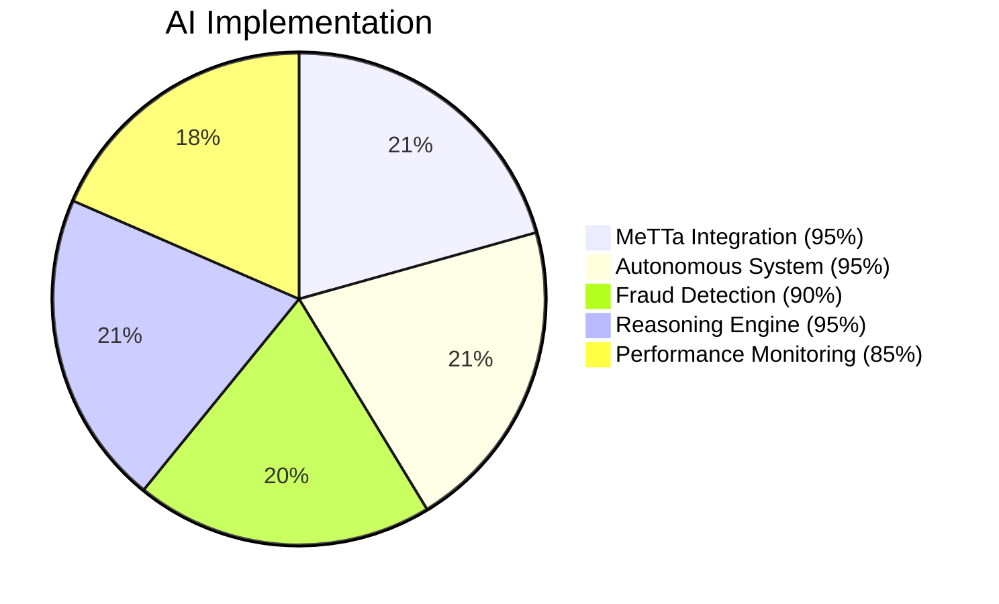

## 8. Critical Path Analysis

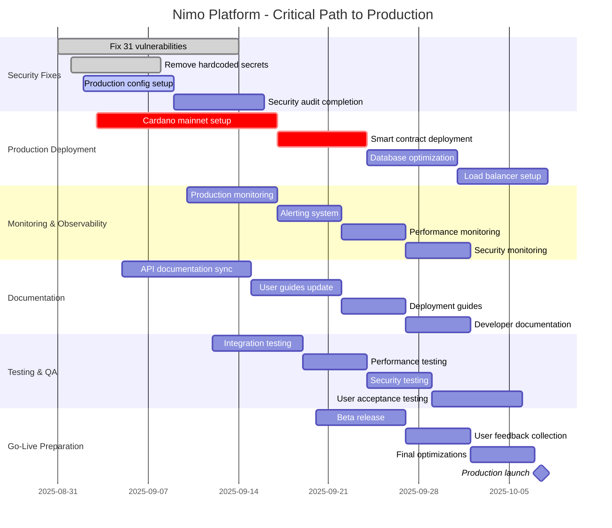

## 9. Risk Mitigation Matrix

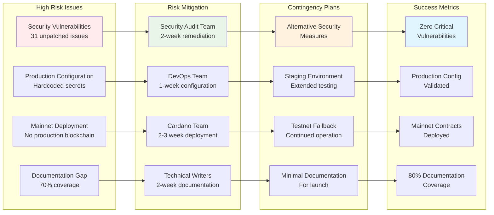

## 10. Component Dependency Map

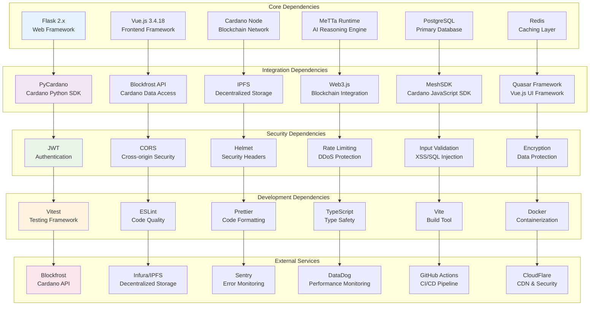

---

## Legend

### Status Indicators
- ✅ **Implemented** - Fully functional and tested
- 🔄 **In Progress** - Partially implemented, needs completion
- ❌ **Missing** - Not implemented, required for production
- ⚠️ **Needs Attention** - Implemented but requires improvement

### Priority Levels
- **P0** - Critical, blocks production deployment
- **P1** - High, should fix before launch
- **P2** - Medium, nice to have for optimal experience

### Component Types
- **API Endpoints** - RESTful API interfaces
- **Services** - Business logic implementations
- **Components** - UI/UX elements
- **Contracts** - Smart contract implementations
- **Tests** - Automated testing suites
- **Documentation** - Technical and user guides

---

**Diagram Version:** 1.0  
**Last Updated:** August 31, 2025  
**Next Review:** September 15, 2025